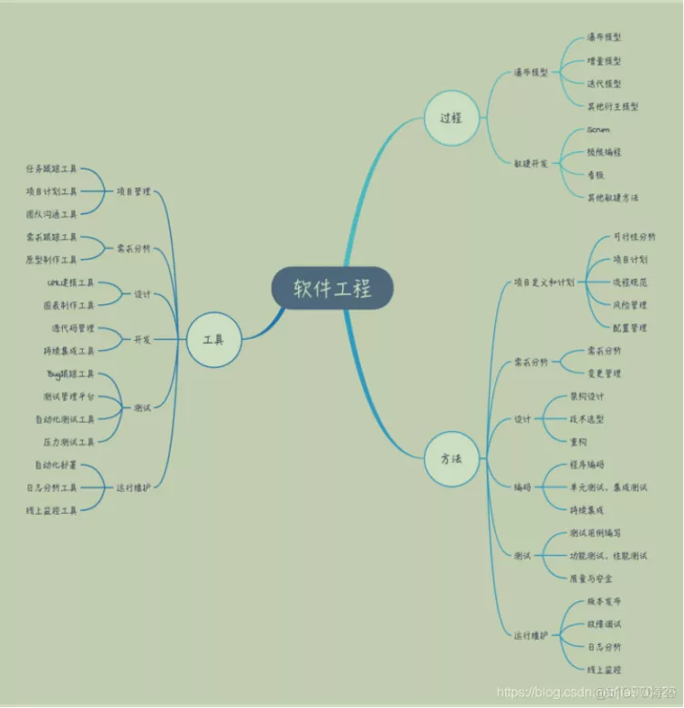
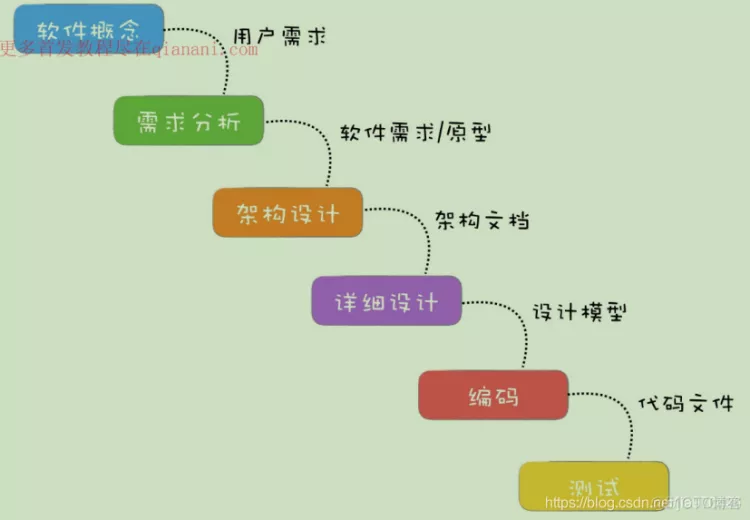
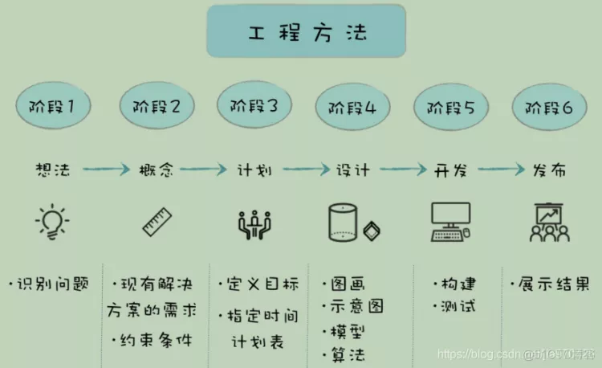
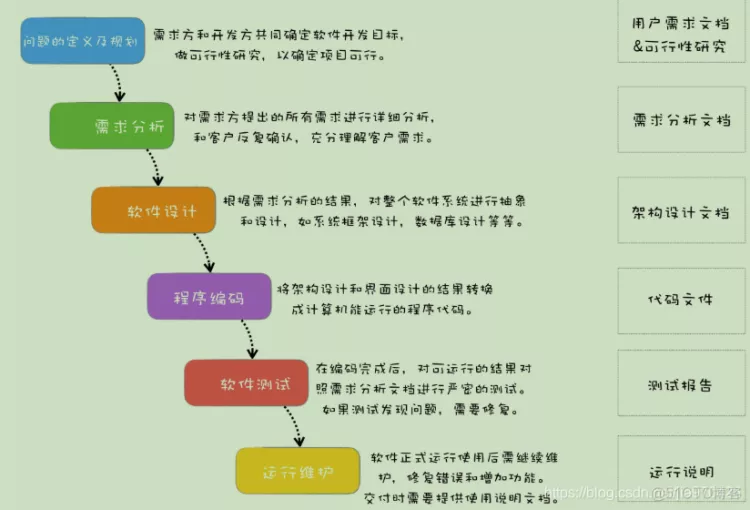
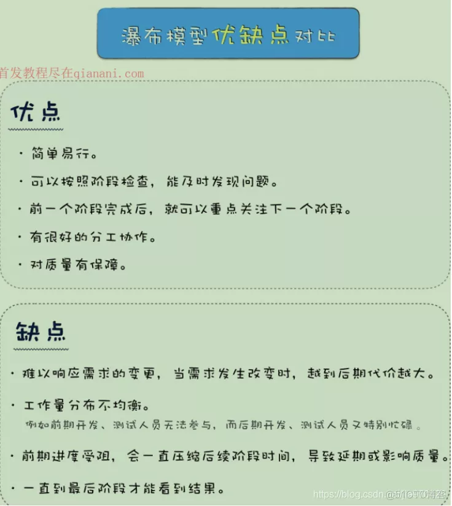
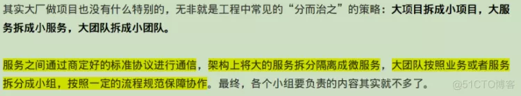
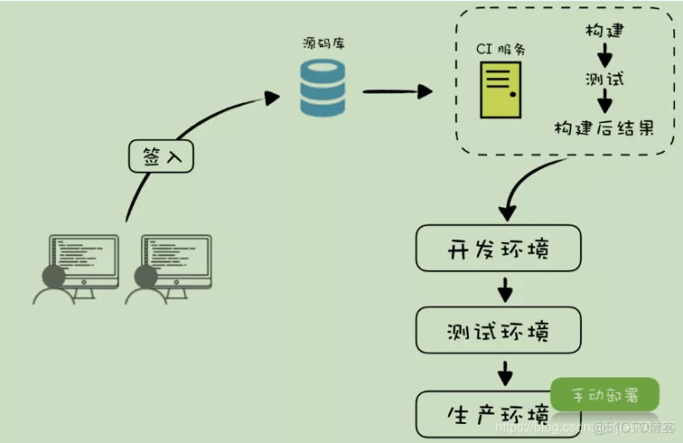
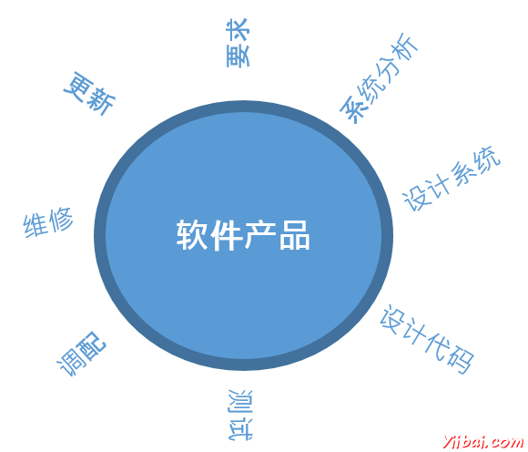
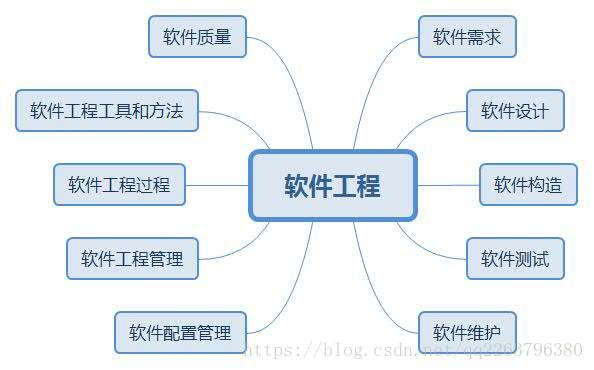

# 软件工程

- 软件概述

```
软件是软件工程的研究对象，也是软件工程的产品形态与客观存在。

工程是将理论和知识应用于实践的科学，其目的是经济有效的解决实际问题。
```



- 软件本质特性，软件具有复杂性、一致性、可变性和不可见性等固有的内在特性，这是造成软件开发困难的根本原因

```
软件=程序+数据+文档

软件工程=过程+方法+工具
```





- 瀑布模型，Code And Fix，瀑布模型的问题 不能及时响应需求变更。




- 敏捷开发，快速迭代 持续集成 拥抱变化，敏捷开发更注重软件开发中人的作用，需要团队成员以及客户之间的紧密协作。





- 基础Git和CI的开发流程，玩会github你的软件工程基本上就没什么问题了
  

  

# 简单的软件设计

## 一、需求分析：

1. 相关系统分析员向用户初步了解需求，然后用相关的工具软件列出要开发的系统的大功能模块，每个大功能模块有哪些小功能模块，对于有些需求比较明确相关的界面时，在这一步里面可以初步定义好少量的界面。bonnidee88


2. 系统分析员深入了解和分析需求，根据自己的经验和需求用WORD或相关的工具再做出一份文档系统的功能需求文档。这次的文档会清楚列出系统大致的大功能模块，大功能模块有哪些小功能模块，并且还列出相关的界面和界面功能。


3. 系统分析员向用户再次确认需求。


4. 可行性分析



## 二、详细设计：

1. 在概要设计的基础上，开发者需要进行软件系统的详细设计。在详细设计中，描述实现具体模块所涉及到的主要算法、数据结构、类的层次结构及调用关系。


2. 需要说明软件系统各个层次中的每一个程序(每个模块或子程序)的设计考虑，以便进行编码和测试。


3. 应当保证软件的需求完全分配给整个软件。详细设计应当足够详细，能够根据详细设计报告进行编码。



## 三、编程代码

1. 在软件编码阶段，开发者根据《软件系统详细设计报告》中对数据结构、算法分析和模块实现等方面的设计要求，开始具体的编写程序工作，分别实现各模块的功能，从而实现对目标系统的功能、性能、接口、界面等方面的要求。


2. 在规范化的研发流程中，编码工作在整个项目流程里最多不会超过1/2，通常在1/3的时间，所谓磨刀不误砍柴功，设计过程完成的好，编码效率就会极大提高。


3. 编码时不同模块之间的进度协调和协作是最需要小心的，也许一个小模块的问题就可能影响了整体进度，让很多程序员因此被迫停下工作等待，这种问题在很多研发过程中都出现过。

## 四、测试

测试编写好的系统。交给用户使用，用户使用后一个一个的确认每个功能。软件测试有很多种:按照测试执行方，可以分为内部测试和外部测试。
