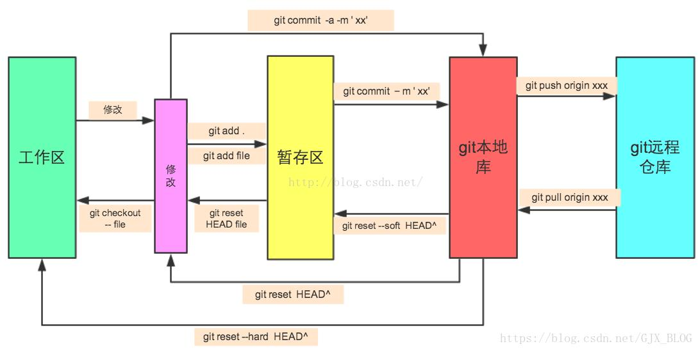

# 需求分析

- 类flappy bird游戏

# 设计文档

- 类flappy bird游戏

# 场景拆分

- godot bird v1.0.0，笨鸟先飞版本，只有100行代码超级简单

- 每个人对场景的理解可能都不相同，建议大家先不要看godot bird，自己实现一下

- 细节有无数种实现方式，要有大局观，不要局限在细节上

```
Git 有三种状态，你的文件可能处于其中之一：

已提交（committed）：已提交表示数据已经安全的保存在本地数据库中。

已修改（modified）：已修改表示修改了文件，但还没保存到数据库中。

已暂存（staged）：已暂存表示对一个已修改文件的当前版本做了标记，使之包含在下次提交的快照中。

Git在未进行commit操作之前，存在三种状态：Untracked files，Changes not staged for commit及Changes to be committed，
每种状态之间可以随意进行互相转换。了解这三种状态各自所对应的不同情况，能够帮助你方便有效的使用Git来管理项目。
```


