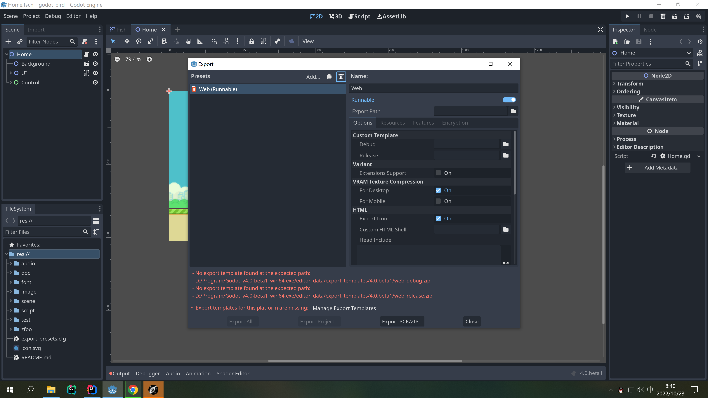
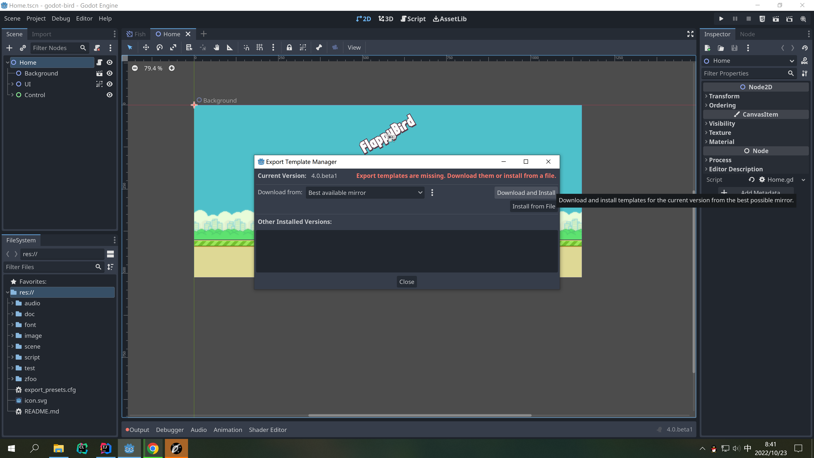

# 优化加速效果

- 加了拖影效果
- 加速时相机往中间移动

# 打包前设置

- 不同屏幕尺寸不一样，得让游戏窗口自适应，设置stretch


# 下载打包模板

- 官网下载对应版本的模板，一般是以export_templates结尾，这个打包模板是windows，android，browser都是用的模板
- 安装模板，建议在浏览器单独下载（下载速度可能更快）





# 打包windows

- 选择对应平台直接打包
```
godot 4.0 beta1打包windows和html5有bug，优先使用最新版本的godot
```

# 打包浏览器web browser

- beta3版本打包浏览器有bug，等修复了再演示
