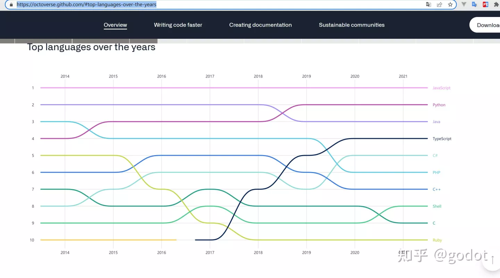
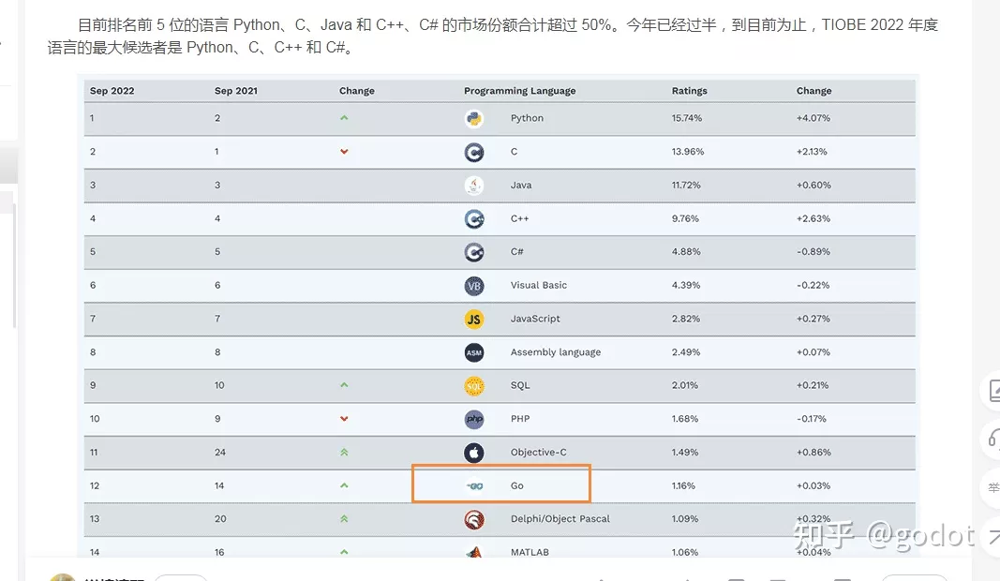

# 游戏服务器开源框架zfoo

- [万能的游戏服务器框架](https://github.com/zfoo-project/zfoo) 

# 为godot定制的服务器框架zfoo

# 为什么是java，zfoo是一个跨语言的服务器框架，其它语言是可选项

- GdScript是面向对象的脚本语言，java是面向对象的强类型语言


- java就像幽灵，无处不在，总有一天你要直视他

```
应用业务层服务器市场，Java，Java的Spring boot生态太好了
大数据方向，Hadoop Hive HBase Spark
Java的桌面市场，如Idea，Android Studio全家桶，Java Swing做的。
Java的移动市场Android，基本上不太能被go抢占。
```

- 最近原神的私服就是用java写的，[如何看待原神私服横行，无人管理的现象?](https://www.zhihu.com/question/531450724/answer/2524603923)

```
前者为github官方的统计，后者为各大网站和搜索引擎的统计。
```




- 成年人不做选择，全都要，用对的工具解决对应的问题

```
cpp，java，go全都要
```

# godot200集教程最终是准备做成一个网络游戏，鸟了个鸟
