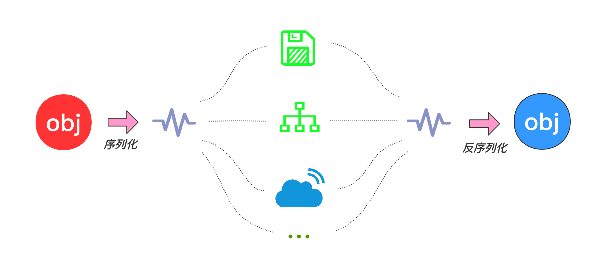

# 服务器的学习曲线

- 服务器开始难，后面简单，刚开始遇到一些难以理解的可以放一放

- 客户端刚开始简单，后买你难，正好和服务器相反

```
提供一对一服务的叫客户端，提供一对多服务的叫服务器

服务器是向非常多的用户提供服务，在设计之初就有考虑高并发的场景
```

- 做游戏做成网络游戏出线的机率大一点，看看单机版本的羊了个羊，如果是单机的还会玩吗？

# excel配置游戏里的数据

- 策划数据填写工具：Excel等（是的还是它，很多项目会用Excel做数据填写和检查，然后转表成为游戏引擎读取的数据）

```
改excel风险可控

如果把数据写在游戏代码中就要频繁的改动，容易出错
```

# 在服务器中读取excel

- 策划数据填写工具：Excel等（是的还是它，很多项目会用Excel做数据填写和检查，然后转表成为游戏引擎读取的数据）

```
改excel风险可控

如果把数据写在游戏代码中就要频繁的改动，容易出错
```

# 序列化和反序列化



- 序列化：将 Java 对象转换成字节流的过程

```
序列化过程：是指把一个 Java 对象变成二进制内容，实质上就是一个 byte[]。
因为序列化后可以把 byte[] 保存到文件中，或者把 byte[] 通过网络传输到远程(IO)，
如此就相当于把 Java 对象存储到文件或者通过网络传输出去了。
```

- 反序列化：将字节流转换成 Java 对象的过程。

```
反序列化过程：把一个二进制内容(也就是 byte[])变回 Java 对象。
有了反序列化，保存到文件中的 byte[] 又可以“变回” Java 对象，或者从网络上读取 byte[] 并把它“变回” Java 对象。
```

```
以面向对象的方式将数据存储到磁盘上的文件。例如，Redis 存储 Student 对象的列表。
将程序的状态保存在磁盘上。例如保存游戏状态。
通过网络以表单对象形式发送数据。例如，在聊天应用程序中以对象形式发送消息。
```

- 为什么需要序列化与反序列化

```
当两个进程进行远程通信时，可以相互发送各种类型的数据，包括文本、图片、音频、视频等， 而这些数据都会以二进制序列的形式在网络上传送。
当两个 Java 进程进行通信时，需要 Java 序列化与反序列化实现进程间的对象传送
。换句话说，一方面，发送方需要把这个 Java 对象转换为字节序列，然后在网络上传送；另一方面，接收方需要从字节序列中恢复出 Java 对象。
```
