# 版本升级修bug

- 代码报错，const方法无法overider覆盖
  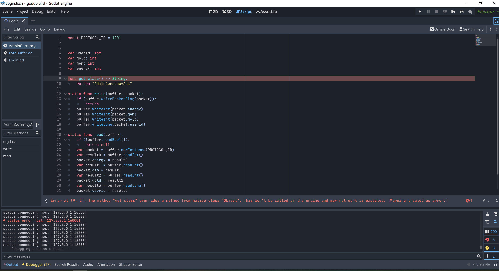
  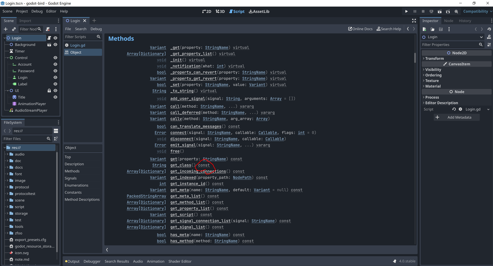

- Array -> Array[xxx]，泛型转换错误
  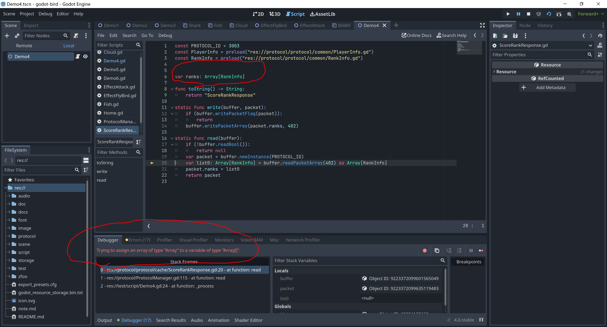
  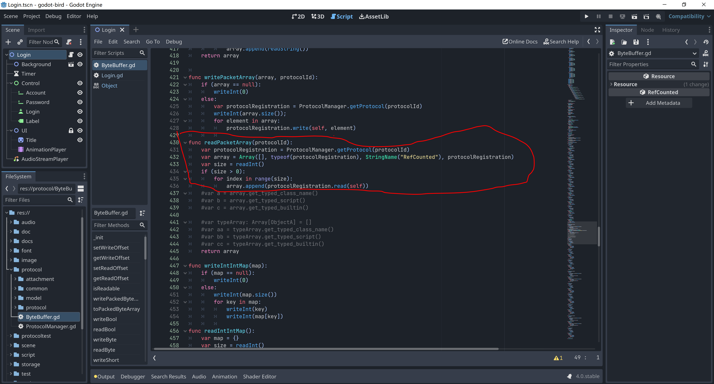

- 新建立的线程里面的代码无法断点，只能打印日志查看；如果里面有报错线程就会立即退出，不会有如何警告
  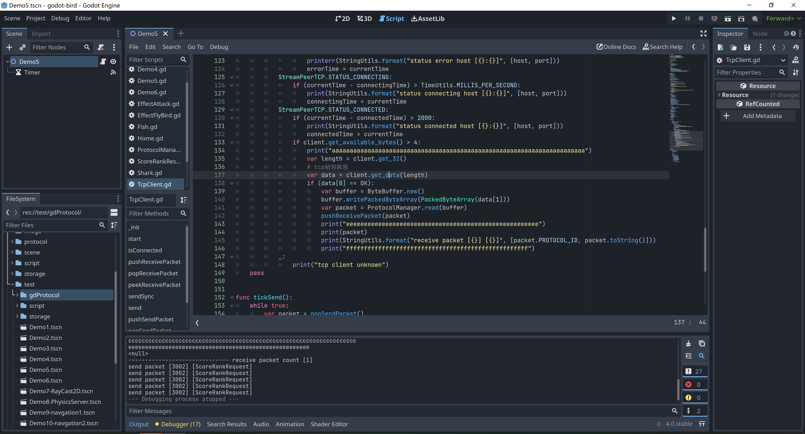

- 废弃的类，直接删除
  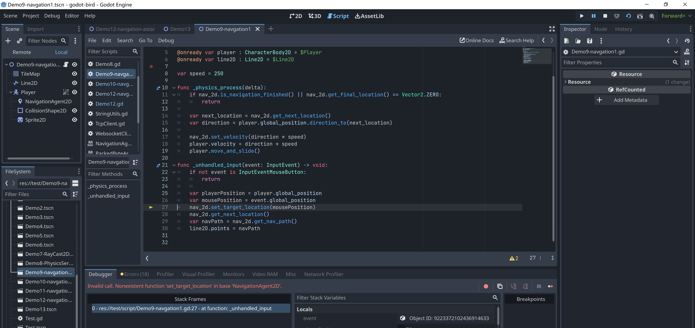
  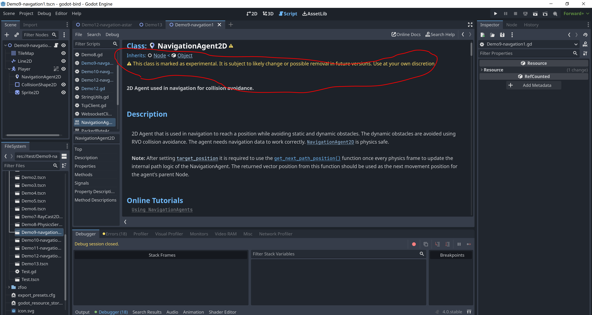

- 小鸟的动画没有播放出来，一个一个运行之前的测试用例，最小化定位出错的位置
  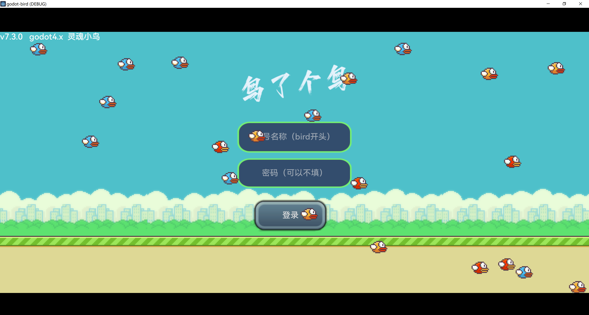
  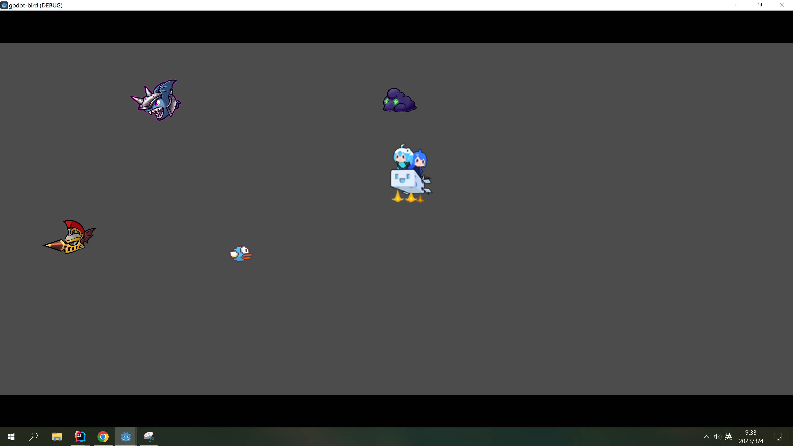
  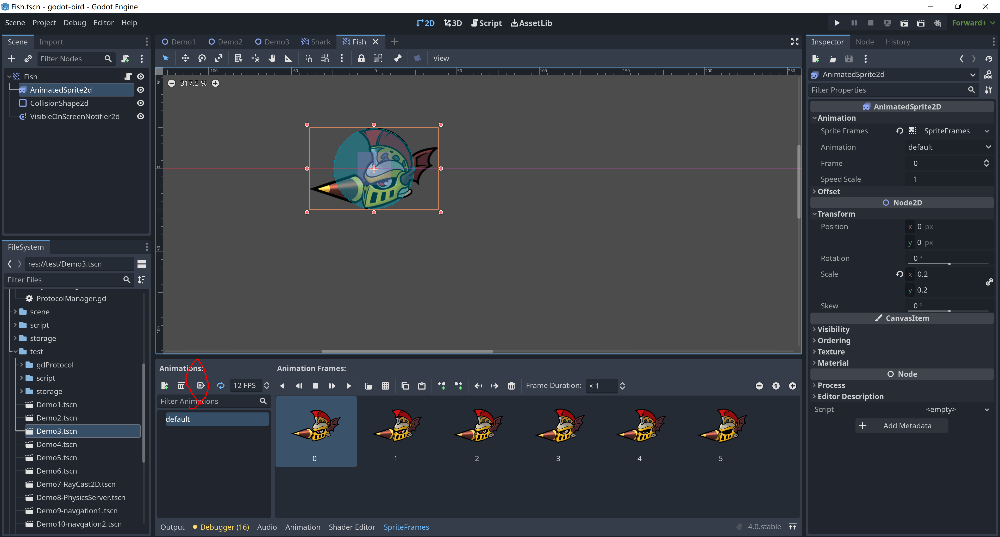

- 版本兼容，多写测试用例，一个质量高的项目测试工程应该要和主工程相当
  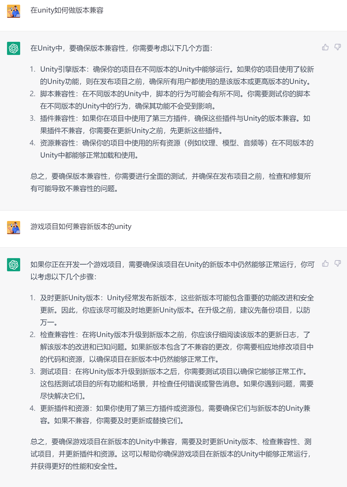
  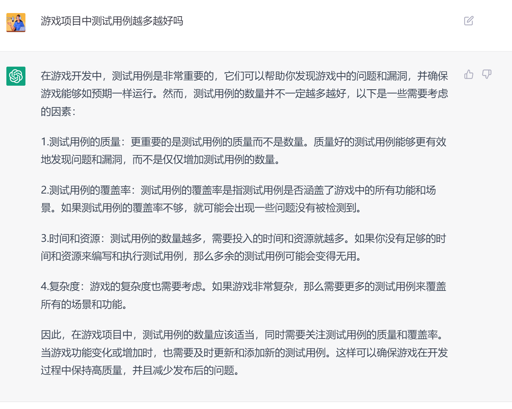